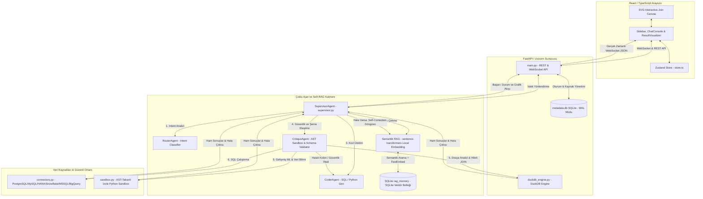

# 📊 DeepBI Analytics Studio: Çok Kaynaklı Otonom Yapay Zekâ Veri Asistanı & BI İstasyonu

DeepBI Analytics Studio; ilişkisel veritabanları (**SQLite, PostgreSQL, MySQL, MS SQL Server, Snowflake, Google BigQuery, SAP S/4HANA**) ve yapılandırılmış veri dosyaları (**Excel, CSV, TSV**) üzerinde doğal dilde analitik sorgular gerçekleştiren, akıllı tahminleme, kümeleme ve anomali tespiti algoritmaları çalıştıran, otonom hata düzeltme (**Self-Correction**) döngüsüne sahip, **RAM dostu DuckDB analitik SQL motoru** ve **Yerel Depolama Yedeği (Snapshots)** altyapısı barındıran **uçtan uca bir otonom veri bilimi ve iş zekası (BI) platformudur**.

Proje; modern ve premium **Vercel/Linear Minimalist Indigo** tasarım diline sahip React/TypeScript arayüzü ile FastAPI/Uvicorn tabanlı izole, yüksek hızlı ve sandbox korumalı bir veri işleme katmanını bir araya getirir.

---

## 🏗️ Ajan Mimarisi ve Çalışma Mantığı (Agentic Consensus Architecture)

DeepBI, veri güvenliği, işlem hızı ve sıfır hata toleransı hedefleriyle **modüler ve çoklu ajan konsensüsü (Multi-Agent Consensus)** yapısında tasarlanmıştır.



### 🤖 Çoklu Ajan Konsensüsü (Multi-Agent Consensus) Detayları

Sürecin her bir adımı, kendine has uzmanlık alanları bulunan bağımsız karar birimleri tarafından koordine edilir:

1. **RouterAgent (Yönlendirici)**: Kullanıcı sorusunu ve seçilen kaynakları analiz eder. Doğal dildeki makine öğrenmesi (ML/tahminleme), kümeleme (K-Means), anomali tespiti niyetlerini otomatik yakalar veya `/explain`, `/forecast`, `/clean`, `/pivot`, `/corr`, `/help` gibi slash komutlarını algılayarak rotayı çizer.
2. **CoderAgent (Yazılımcı)**: Seçilen veri kaynağının kolon şemalarını, RAG hafızasından gelen benzer başarılı kod şablonlarının rehberliğinde derleyerek analitik DuckDB SQL sorgusunu veya Scikit-Learn regresyon kodunu yazar.
3. **CritiqueAgent (Denetçi)**: SQL ve Python kodlarını çalıştırmadan önce iki aşamalı doğrulamadan geçirir:
   - **Şema Eleştirisi**: Üretilen SQL sorgusundaki sütun isimlerinin, hedef veritabanı veya dosyaların gerçek şemasıyla eşleşip eşleşmediğini doğrular.
   - **AST Sandbox Filtresi**: Python kodlarını AST (Abstract Syntax Tree) ile inceleyerek tehlikeli çağrıları (`eval`, `exec`, `open`) ve yetkisiz sistem kütüphanelerini (`os`, `sys`, `subprocess` vb.) engeller.
4. **VisualizerAgent (Görselleştirici)**: Sorgu sonuçlarının doğasına göre Plotly figürleri tasarlar. Koyu tema (`#09090b`) ile kusursuz uyum sağlamak üzere **tam şeffaf arka planlar (`rgba(0,0,0,0)`), minimalist kılavuz çizgileri (`#21262d`), Inter yazı tipleri ve Indigo renk şemaları** enjekte eder.
5. **Otonom Self-Correction (Kendi Kendini Düzeltme) Döngüsü**: Eğer sorgu veya Python kodu çalışma zamanında (runtime) hata verirse, `rag.py` içindeki `self_correct_loop` devreye girerek hata mesajını ve mevcut şemayı LLM'e besler. Sistem, kullanıcıya hiçbir hata yansıtmadan **en fazla 3 kez** kodu otonom olarak düzeltmeyi dener.

---

## 🎨 Vercel/Linear Minimalist Indigo Tasarım Sistemi

Arayüz tasarımı, standart şablonlardan arındırılarak kurumsal bir SaaS kalitesinde yeniden inşa edilmiştir:
* **Renk Paleti**: Saf siyah yerine zengin Zinc Kömür (`#09090b`), birincil Indigo vurguları (`#6366f1`), ve yumuşak gri tonlar.
* **Glassmorphic Kartlar**: `border: 1px solid rgba(255, 255, 255, 0.08)` ve `backdrop-filter: blur(12px)` ile tasarlanmış modern buzlu cam paneller.
* **Tipografi**: Net okunabilirlik sunan, harflerin dikey hizalandığı **Inter** ve **Outfit** yazı tipleri.
* **Emoji Arındırma**: Arayüzdeki tüm çiğ emojiler kaldırılmış, yerlerine uyumlu renk geçişlerine sahip yüksek çözünürlüklü **Lucide React** ikonları entegre edilmiştir.
* **Otomatik Esnek Panel Kontrolü (Dynamic Split View)**: Sağ taraftaki grafik ve tablo içeren analiz paneli kapatıldığında aradaki sürükleme çizgisi gizlenir ve Chat ekranı yumuşak bir geçiş animasyonuyla ekranın `%100`'ünü kaplar. Yeni bir analiz başlatıldığında veya eski mesaja tıklandığında panel otomatik olarak eski konumuna açılır.

---

## 🚀 Çekirdek Sistem Kabiliyetleri ve İleri Seviye Özellikler

### 1. Kurumsal Veritabanı Konnektörleri & 5000 Satırlık Akıllı Snapshots
* **Genişletilmiş Veritabanı Desteği**: Standart veritabanlarının yanı sıra kurumsal düzeyde **SAP S/4HANA**, **Snowflake**, **Google BigQuery** ve **Microsoft SQL Server (MSSQL)** sistemleri için tam entegre schema discovery ve bağlantı yönetimi sunar.
* **Ayrıntılı Şema Keşfi**: Canlı sistemlerden dinamik olarak tabloları ve sütunları sorgulayarak şemaları otomatik çıkartır.
* **Hızlı Snapshot Motoru**: Canlı ERP ve OLTP sistemlerine yük bindirmemek için verileri 5000'er satırlık paketler halinde (`fetchmany`) çekerek yerel DuckDB/SQLite replikasına kopyalar.
* **Otomatik İndeksleme**: Snapshot tablolarındaki `id`, `key`, `kod`, `date` vb. anahtar kelimeleri içeren sütunlarda otomatik `CREATE INDEX` tetiklenerek downstream DuckDB JOIN sorguları milisaniyeler seviyesine indirilir.

### 2. İnteraktif SVG Şema Tasarımcısı (Schema Designer)
* **Görsel İlişkilendirme**: Veritabanı şemalarını gösteren modal yerine, yan yana tabloların sütun düğümlerine tıklayarak aralarında **Cubic Bezier** eğrileri çizen dinamik bir SVG alanı sunar.
* **Join Tipi Özelleştirme**: Çizilen ilişkilerin üzerine gelindiğinde (hover) çizgi parıldayan bir gradyanla aydınlanır ve açılan popup menüyle Join tipi (INNER, LEFT, RIGHT, OUTER) kolayca değiştirilebilir veya ilişki silinebilir.

### 3. Gelişmiş Spreadsheet Tablosu ve Sıralama
* **Kolon Bazlı Sıralama**: Tablo başlıklarına tıklanarak veriler anında artan/azalan şeklinde sıralanır.
* **Çoklu Satır Seçimi**: Satırların solundaki checkbox'lar ile seçim yapılabilir. Seçim yapıldığında sağ üstte yeşil bir parlama efektiyle `"X Satır Seçildi"` rozeti belirir.
* **Seçime Göre Dışa Aktarma**: Excel (OpenPyXL) ve PDF (ReportLab) indirme butonları, eğer satır seçilmişse **sadece seçilen satırları**, seçilmemişse tüm veri kümesini kurumsal rapor formatında dışa aktarır.

### 4. Güvenli Kod ve Sandbox Altyapısı
* **AST Sandbox Filtresi**: Python kodlarını AST (Abstract Syntax Tree) ile derinlemesine inceleyerek dunder metotlara (`__class__`, `__subclasses__`, `__globals__`, `__dict__`) erişimi, `getattr`/`setattr` fonksiyonlarını, `eval`, `exec`, `open`, `__import__` gibi tehlikeli çağrıları ve yetkisiz sistem kütüphanelerini engeller.
* **Multi-Platform PDF Font Desteği**: Rapor çıktılarındaki Türkçe karakter sorununu çözmek amacıyla Linux sistemlerinde (`/usr/share/fonts`, `/usr/local/share/fonts`, `~/.fonts`) tarama yaparak `DejaVuSans.ttf` veya `LiberationSans.ttf` gibi Unicode destekleyen sistem yazı tiplerini otomatik olarak tespit edip entegre eder.

### 5. Yerel Semantik RAG Bellek Döngüsü
* **FastEmbed ve Hugging Face**: Semantik arama için yerel olarak `sentence-transformers/paraphrase-multilingual-MiniLM-L12-v2` modeli kullanılır. Türkçe ve İngilizce sorguları yüksek doğrulukla anlamlandırır.
* **SQLite rag_memory**: Eski düz JSON (`query_memory.json`) dosyası yerine, WAL modunda çalışan SQLite tabanlı bir vektör saklama alanı kullanılarak eşzamanlı yazma sorunları engellenmiştir.
* **Geri Bildirim Döngüsü (Reinforcement)**: Arayüzdeki her mesaja eklenen Beğen (Thumbs Up) / Beğenme (Thumbs Down) ikonları üzerinden `/api/sessions/{session_id}/messages/{message_id}/feedback` uç noktasına sinyal gönderilir. Başarılı sorgular RAG hafızasına otomatik eğitilmek üzere kaydedilir.

### 6. Doğal Dilli Grafik Ayarlayıcısı (Client-side Chart Tuner)
* **Anında Düzenleme**: Plotly grafik panelinin altında yer alan kutucuğa *"sütun grafiğe çevir ve mor yap"* gibi komutlar yazıldığında, istemci tarafındaki akıllı parser komutu işler ve sunucuya gitmeden grafiği anında günceller.

---

## 📂 Kod Tabanı ve Dosya Yapısı Kataloğu (File & Function Directory)

Projedeki her bir dizin ve kritik dosya, belirli sorumlulukları üstlenen temiz kod mimarisine göre yapılandırılmıştır:

### 🖥️ Frontend (React & TypeScript) - `frontend/src`

* **`App.tsx`**: Uygulamanın ana giriş ve yerleşim (layout) merkezidir.
  * *Tema Yönetimi*: `theme` state'i (`light`/`dark`) tarayıcı hafızasıyla senkronize çalışır.
  * *Dialog Kontrolleri*: API ayarları (`Dialog` - LLM yapılandırmaları) ve veri kaynağı ayarları panellerini yönetir.
  * *Split-Pane Dragging*: Fare hareketleriyle sol/sağ ekran oranını ayarlar.
* **`context/store.ts`**: Zustand tabanlı global veri deposudur.
  * *State Arayüzleri*: `FileSource`, `DBSource`, `Message`, `ChatSession`, `JoinRelation` gibi tüm nesne tiplerini barındırır.
  * *`fetchSources` / `fetchFiles`*: Backend REST API'sinden veri kaynaklarını ve yüklenmiş CSV/Excel dosyalarını çeker.
  * *`sendMessage`*: WebSocket (`/ws/chat`) üzerinden kullanıcı mesajını gönderir, gelen veri akışını (`Bağlantı kuruluyor...`, `[RouterAgent] ...`) gerçek zamanlı olarak yakalayıp chat geçmişine yazar.
* **`context/translations.ts`**: Türkçe ve İngilizce dilleri arasında anında geçiş sağlayan sözlük katmanıdır.
  * *`translations` nesnesi*: Sol üst panelden değiştirilebilen çift dilli i18n altyapısını kurar.
* **`components/Sidebar.tsx`**: Oturum geçmişini ve aktif oturumları listeleyen sol gezinti panelidir.
  * *`ChatSession` Yönetimi*: Yeni oturum oluşturma, silme ve oturum başlığını düzenleme işlemlerini Zustand aksiyonlarıyla bağlar.
* **`components/ChatConsole.tsx`**: Kullanıcıyla yapay zekanın mesajlaştığı interaktif terminal arayüzüdür.
  * *`highlightCode`*: Kod bloklarını renklendiren güvenli tokenizer yapısıdır. DOM yapısını bozmadan `SELECT`, `FROM` gibi SQL anahtar kelimelerini güvenle izole eder.
  * *SVG Join Designer Entegrasyonu*: Tablolar arası fiziksel ilişkilerin SVG canvas üzerinde çizildiği ve yönetildiği görsel tasarım alanını barındırır.
  * *Feedback Kontrolleri*: Kullanıcının cevapları beğendiğini/beğenmediğini backend'e bildiren butonları içerir.
* **`components/ResultVisualizer.tsx`**: Sorgu sonuçlarının görselleştirildiği ve tablolandırıldığı sağ paneldir.
  * *Plotly Grafik Entegrasyonu*: Gelen JSON grafik verisini Vercel/Linear Indigo koyu temasıyla derleyip ekrana basar.
  * *Gelişmiş Spreadsheet*: Sütun başlığına tıklayarak sıralama yapan `handleSort` algoritmasını ve çoklu satır seçimi sağlayan checkbox mantığını yönetir.
  * *Client-side Chart Tuner*: Kullanıcının doğal dilde yazdığı grafik düzenleme komutlarını işleyen yerel parser metodunu içerir.
* **`components/SourceManager.tsx`**: Veritabanı bağlantılarının (SQLite, PG, MySQL, MSSQL, Snowflake, BigQuery, HANA) oluşturulduğu, test edildiği ve düzenlendiği gelişmiş CRUD arayüzüdür.
  * *`handleTest`*: `/api/sources/test-connection` üzerinden kimlik bilgilerini test eder.
  * *`handleSave`*: Yeni bağlantı kaydeder veya düzenleme modunda `PUT` isteği gönderir.
  * *`handleTakeSnapshot`*: Seçilen veritabanının anlık kopyasını yerel ortama kopyalamak için backend snapshot tetikler.
* **`components/FileUpload.tsx`**: CSV, Excel, TSV gibi dosyaların sürükle-bırak yöntemiyle sisteme yüklendiği bileşendir.
  * *`handleUpload`*: Sunucuya `multipart/form-data` formatında veri göndererek otomatik şema tespiti yaptırır.

---

### ⚙️ Backend (Python & FastAPI) - `backend/app`

#### 🤖 Ajanlar ve RAG Katmanı (`app/agent`)
* **`supervisor.py`**: Ajanların şef orkestratörüdür (`SupervisorAgent` sınıfı).
  * *`process_query`*: WebSocket kanalından gelen girdileri alıp adımları (`RouterAgent`, `CoderAgent`, `CritiqueAgent`) koordine eder.
  * *`_classify_intent`*: Kullanıcı sorusunu analiz ederek sorgunun SQL mi, Pandas mı yoksa ML mi olduğunu belirler.
  * *`_execute_local_sql` / `execute_pandas_fn`*: Kodları güvenli sandbox veya veritabanlarında koşturur.
  * *`_generate_sql_llm` / `_generate_duckdb_sql_llm` / `_generate_pandas_llm`*: LLM'e sistem rolü ve RAG hafızasından gelen benzer şablonları ekleyerek optimize edilmiş İngilizce promptlar üretir.
* **`rag.py`**: Bellek alma ve otonom hata düzeltme katmanıdır.
  * *`retrieve_similar`*: `paraphrase-multilingual-MiniLM-L12-v2` vektör modeliyle, SQLite'taki `rag_memory` tablosundan semantik olarak en yakın 3 başarılı analizi çeker.
  * *`perform_pre_execution_critique`*: SQL sorgularını çalıştırmadan önce sütun düzeyinde şema denetimi yapar.
  * *`self_correct_loop`*: Hata alan kodları, hata çıktısıyla birlikte LLM'e geri gönderip otonom düzelten ardışık döngüdür.
* **`memory.py`**: Başarılı sorgu kalıplarının hafızaya kaydedilmesini sağlayan yardımcı metotları barındırır.
  * *`add_successful_query`*: Başarılı sorguyu ve şemasını vektörleştirilmek üzere veritabanına ekler.

#### 🧠 Analitik Çekirdek ve İşleme Ünitesi (`app/core`)
* **`sandbox.py`**: Güvenli Python kod çalıştırma sandbox'ıdır (`PandasSandbox` sınıfı).
  * *`_check_code_safety`*: AST (Abstract Syntax Tree) modülü ile kodu parse edip `import os`, `sys`, `subprocess`, `eval`, `exec`, `open` gibi tehlikeli çağrıların varlığını kontrol eder, varsa çalışmayı anında durdurur.
  * *`run_pandas_code`*: Kodu izole bir alt süreçte (`run_isolated`) çalıştırarak ana sunucuyu çökme veya aşırı bellek tüketiminden korur.
* **`duckdb_engine.py`**: Yüklenen Excel/CSV dosyalarını DuckDB belleğine kaydeden ve sorgulayan motordur.
  * *`execute_duckdb_query`*: Bellek-içi DuckDB tabloları üzerinde yüksek performanslı SQL sorguları koşturur, sonuçları dataframe olarak döndürür.
* **`sql_sanitizer.py`**: Üretilen SQL kodlarını temizler.
  * *`sanitize_and_validate_sql`*: `sqlglot` kütüphanesini kullanarak tehlikeli DDL komutlarını (`DROP`, `ALTER`, `TRUNCATE`) engeller ve sorgulara otomatik `LIMIT 5000` sınırı ekler.
* **`report_builder.py`**: PDF ve Excel formatında dışa aktarım yapan raporlama ünitesidir.
  * *`build_excel_report`*: `openpyxl` kullanarak sayısal hücreleri sağa hizalı, kolon genişlikleri otomatik ayarlanmış Excel sayfaları tasarlar.
  * *`build_pdf_report`*: `reportlab` ile kurumsal kapak, grafik vektör görseli ve veri tabloları içeren şık PDF raporları üretir.
* **`logger.py`**: Yapılandırılmış ve izlenebilir bir üretim ortamı için merkezi günlük tutma sistemidir.
  * *Özelleştirilmiş Log Şablonları*: Uvicorn/FastAPI ve çoklu ajan işlem akışlarının, hata ve uyarıların tek bir formattan yönetilmesini sağlar.
* **`clustering.py`**: Veri kümeleri üzerinde K-Means kümeleme algoritması koşturur.
* **`anomaly.py`**: Verilerdeki sıra dışı sapmaları yakalar.
* **`predictor.py`**: Zaman serisi tahminlemesi yapar.
* **`correlation.py`**: Sayısal kolonların birbiriyle ilişkisini hesaplar.

#### 💾 Veritabanı ve Bağlantı Havuzu Katmanı (`app/database`)
* **`connectors.py`**: Farklı veritabanı türleriyle bağlantı kuran havuz katmanıdır.
  * *`get_connection`*: SQLite, PostgreSQL, MySQL, MSSQL, Snowflake, Google BigQuery ve SAP S/4HANA için özelleşmiş connection nesnelerini üretir.
  * *`discover_schema`*: Veritabanı sistem katalog tablolarını sorgulayarak tablo isimlerini ve sütun yapılarını keşfeder.
* **`manager.py`**: SQLite `metadata.db` üzerindeki CRUD operasyonlarını yönetir.
  * *`init_metadata_db`*: Veritabanını WAL modunda başlatır; `data_sources`, `uploaded_files`, `sessions`, `chat_messages`, `rag_memory` gibi tabloları oluşturur.
* **`snapshots.py`**: Büyük veritabanı tablolarının yerel kopyasını alan snapshot yöneticisidir.
  * *`create_database_snapshot`*: Uzak sunucudaki tabloları 5000'er satırlık paketler halinde kopyalar ve yerel SQLite veri tabanına indeksleriyle birlikte kaydeder.

---

## ⚡ Kurulum ve Çalıştırma Kılavuzu (Setup Guide)

### Sistem Gereksinimleri
* **Python 3.10 veya daha yeni bir sürüm**
* **Node.js 18 veya daha yeni bir sürüm**
* **Git**

---

### 1. Backend (Python/FastAPI) Kurulum Adımları

1. **`backend` klasörüne gidin:**
   ```bash
   cd backend
   ```

2. **Python sanal ortamı (virtual environment) oluşturun ve aktif edin:**
   * **Windows (PowerShell):**
     ```powershell
     python -m venv venv
     .\venv\Scripts\Activate.ps1
     ```
   * **macOS / Linux:**
     ```bash
     python3 -m venv venv
     source venv/bin/activate
     ```

3. **Gerekli tüm kütüphaneleri yükleyin:**
   ```bash
   pip install -r requirements.txt
   ```

4. **Çevresel Değişkenleri Yapılandırın:**
   `backend` dizininde bir `.env` dosyası oluşturun ve LLM kimlik bilgilerinizi girin:
   ```env
   DEEPSEEK_API_KEY=sk-your-api-key-here
   DEEPSEEK_BASE_URL=https://api.deepseek.com/v1
   ```

5. **Sunucuyu başlatın:**
   ```bash
   python -m uvicorn main:app --reload --port 8000
   ```
   *Backend REST API ve WebSocket sunucusu artık `http://localhost:8000` adresinde aktiftir.*

---

### 2. Frontend (React/TypeScript) Kurulum Adımları

1. **`frontend` klasörüne gidin:**
   ```bash
   cd frontend
   ```

2. **Gerekli bağımlılıkları (Node Modules) indirin:**
   ```bash
   npm install
   ```

3. **Geliştirici (Vite Dev) sunucusunu çalıştırın:**
   ```bash
   npm run dev
   ```
   *Arayüz geliştirici portalı `http://localhost:5173` adresinde çalışmaya başlayacaktır.*

---

### 🛠️ Tek Tıkla Geliştirici Ortamı Başlatma (Linux)

Linux üzerinde tek tıkla geliştirici ortamını ayağa kaldırmak için proje kök dizininde:
```bash
chmod +x setup_dev_linux.sh run_dev_linux.sh
./run_dev_linux.sh
```
Betikler otomatik olarak hem sanal ortamı aktifleştirip backend sunucusunu çalıştıracak hem de frontend Vite sunucusunu ayağa kaldıracaktır.

---

## 📊 Veritabanı ve Metadata Yönetimi

Tüm sohbet geçmişleri, yüklenen dosya meta verileri, veritabanı bağlantı şifreleri (şifrelenmiş olarak) ve LLM ayarları backend'deki `metadata.db` isimli SQLite dosyasında saklanır. 

* Veritabanı tablolarının kolon yapıları, tipleri ve veri tabanı ilişkileri hakkında detaylı bilgi almak için kök dizindeki [metadata_schema.md](file:///home/safagok/Repo/BI_chatbot/metadata_schema.md) dosyasını okuyabilirsiniz.

---

## 💡 Kurumsal Raporlama ve Analiz Dışa Aktarımı
* **Excel Belgesi (.xlsx):** Sayısal hücreleri sağa hizalı, başlıkları kalın ve otomatik sütun genişlikli kurumsal rapor formatı.
* **PDF Belgesi (.pdf):** Vektörel grafik çıktısını, kurumsal başlığı ve veri analiz özetlerini içeren sunuma hazır kurumsal PDF formatı.
* **CSV Belgesi (.csv):** Standardize edilmiş virgülle ayrılmış veri dökümü.
