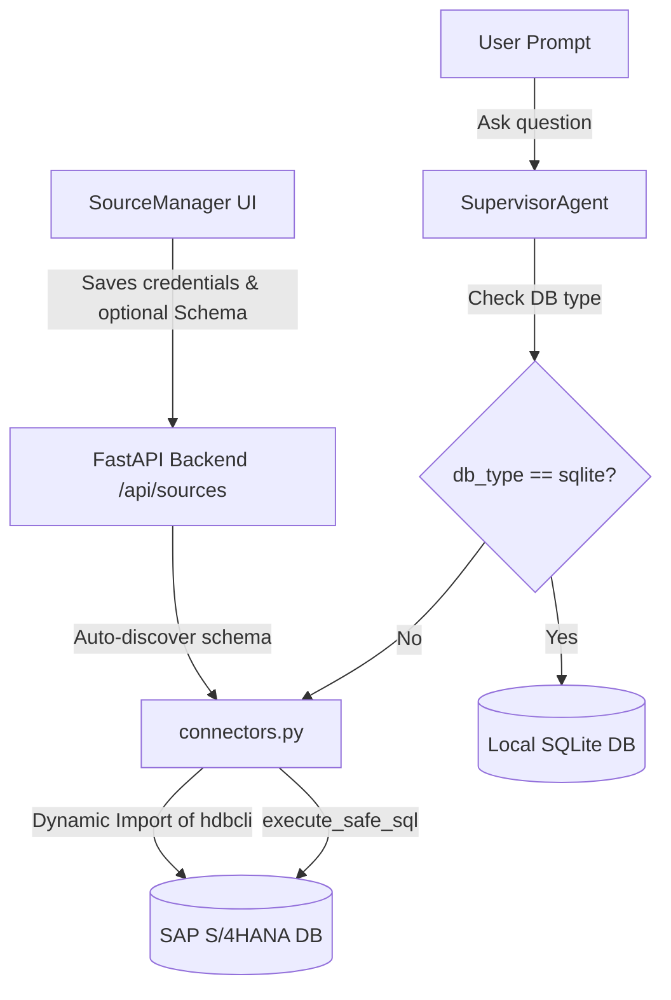

# Walkthrough: SAP S/4HANA Connection Support

We have successfully implemented SAP S/4HANA (HANA Database) connection support across the backend database layers, the specialized supervisor agent, and the frontend connection manager.

---

## 1. Multi-Database Routing & SAP HANA Connector

We expanded the backend connector layer to natively interface with SAP HANA databases while refactoring the SQL supervisor agent to dynamically route queries instead of hardcoding SQLite.

### Architecture & Connection Routing Flow



### Components Added

- **HANA Driver (`hdbcli`) integration**: Added standard driver loading inside `connectors.py` utilizing the official `hdbcli.dbapi` package. It gracefully falls back and outputs friendly `ImportError` installation guides (`pip install hdbcli`) if the package is missing.
- **System Catalog Schema Discovery**: Added intelligent table auto-discovery querying the HANA system views:
  - Fetches the active schema dynamically: `SELECT CURRENT_SCHEMA FROM DUMMY`.
  - Discovers user-defined tables: `SELECT TABLE_NAME FROM SYS.TABLES WHERE SCHEMA_NAME = ?`.
  - Discovers column metadata: `SELECT COLUMN_NAME FROM SYS.TABLE_COLUMNS WHERE SCHEMA_NAME = ? AND TABLE_NAME = ? ORDER BY POSITION`.
- **Query Execution Delegation**: Refactored `SupervisorAgent._execute_local_sql` in `supervisor.py` to route all queries (PostgreSQL, MySQL, SAP S/4HANA) using the unified `connectors.py:execute_safe_sql` engine, eliminating hardcoded SQLite dependencies.

---

## 2. Dynamic SAP HANA Dialect Prompting

To ensure the Coder Agent generates optimal, syntax-accurate SQL for HANA databases, we dynamically inject custom dialect parameters into `_generate_sql_llm`:

```python
dialect_hint = (
    "\n5. Veritabanı tipi SAP S/4HANA (HANA)'dır. SAP HANA SQL standartlarına uygun bir sorgu oluştur. "
    "HANA SQL'de dummy tablosu olarak DUMMY kullanmalısın (örneğin: SELECT ... FROM DUMMY). "
    "Kolon ve tablo isimlerinin büyük-küçük harfe duyarlılığına dikkat et; şemada verildiği haliyle kullan."
)
```

This prevents the LLM from generating incompatible SQLite or PostgreSQL query extensions, guaranteeing maximum prompt execution accuracy.

---

## 3. Premium Frontend Connection UI

We expanded the frontend database connection workspace in `SourceManager.tsx` to include SAP S/4HANA, fully adhering to the dark-mode aesthetic.

- **Option Badge & Port Mapping**: Added **SAP S/4HANA (HANA)** option with the indicator `🏎️`, mapped standard default connection port `30015`, and integrated the beautiful `label-purple` CSS badge tag.
- **Optional Schema Field**: Added a dynamic **Şema (Schema) - İsteğe Bağlı** input form field to let users bind connection sessions to specific database schemas, passing it directly to backend schema discoverers.

## 4. Environment Config & Sidebar Coloring

We finalized the integration by ensuring connection parameters are well-documented and the UI sidebar database tags display in high-fidelity brand colors.

- **Active SAP S/4HANA env documentation**: Updated `backend/.env.example` connections category to mark SAP S/4HANA (HANA) as a fully active supported connection type, adding an optional `HANA_SCHEMA=S4H` config sample to ease integration.
- **Brand Sidebar Database Icon Color**: Colored the sidebar database Lucide icon dynamically for the `'sap_s4hana'` type inside the `dbTypeColor` dictionary in `Sidebar.tsx` using a gorgeous violet/purple theme color (`#a371f7`).

---

## 5. SAP Fiori-Style Connection CRUD & Edit Mode

We redesigned the entire database connection workspace (`SourceManager.tsx`) to match the premium, modern **SAP Fiori layout guidelines** while implementing full support for Editing connections on both backend and frontend layers:

- **Fiori Object Cards**: Connections are listed as elegant card objects. Active/selected cards render with a **left vertical 4px accent line** in the database type's brand color (Purple for SAP S/4HANA, Blue for PostgreSQL, Orange for MySQL, Green for SQLite).
- **Fiori Segmented Selectors**: Replaced default form fields with clean rounded Fiori button selector groups containing icons and distinct select glows.
- **Full Edit CRUD Mode**: Clicking the **Edit (Edit3)** pencil icon next to any connection loads all parameters back into the right detail panel (renamed dynamically to **Bağlantıyı Düzenle**). Passwords remain masked, updating only if the user provides a new string, sending a `PUT` request to `/api/sources/{id}`.

---

## 6. Compilation & Verification Integrity

We verified the complete code base builds and compiles cleanly:
- **Backend Python Compile**:
  ```powershell
  python -m py_compile backend/main.py backend/app/database/manager.py
  ```
  *Status*: **Successfully compiled with 0 errors**.
- **Frontend TypeScript Compile**:
  ```powershell
  npx tsc --noEmit
  ```
  *Status*: **Successfully compiled with 0 errors**.

---

## 7. Premium Core Upgrades & Sandbox Security (Suggestions 1, 3, 4, 6)

We have successfully integrated a complete suite of performance, security, machine learning, and UX upgrades:

### 1. Robust AST-Based Python Sandbox Security (Suggestion 1)
- **Import and System Call Safety Filters**: Added a validation gateway `_check_code_safety` inside `sandbox.py` that utilizes Python's Abstract Syntax Tree (AST) parser to examine generated scripts.
- **Strict Blacklists**: Proactively blocks loading of unsafe builtins or imports (`os`, `sys`, `subprocess`, `shutil`, `socket`, `urllib`, `requests`, `pty`, `ctypes`) and dangerous call invocation (`eval`, `exec`, `open`), returning immediate safety constraints before execution.

### 2. Multi-Dimensional KMeans Clustering Machine Learning (Suggestion 3)
- **Unified ML Clustering Module**: Added `clustering.py` using scikit-learn's `KMeans`, standard scaling, and Principal Component Analysis (PCA) projection.
- **Dynamic Intention Routing**: Modified the routing pipeline in `supervisor.py` and `duckdb_engine.py` to intercept queries containing keywords like "kümeleme", "segment", or "clustering".
- **Interactive Multi-Color Scatter Graphs**: Plotly dynamically outputs beautiful scatter charts (color-coded by segments) using 2D PCA projection for multi-dimensional data sets.

### 3. Accelerated 5000-Row Database Snapshots & Indexing (Suggestion 4)
- **5000-Row Chunk Processing**: Multiplied the row extraction batch size from `1000` to `5000` inside `snapshots.py` to boost replication speeds while maintaining minimal memory usage.
- **Automated Smart Indexing**: Automatically creates relational index structures (`CREATE INDEX IF NOT EXISTS`) in SQLite snapshot databases for columns ending or containing `id`, `key`, `kod`, `date`, etc., drastically accelerating downstream DuckDB analytical joins.

### 4. Natural Language Chart Tuner & Cell Highlighting UX (Suggestion 6)
- **Client-Side Natural Language Chart Tuner**: Embedded an interactive text input bar right under the Plotly canvas in `ResultVisualizer.tsx`. Users can type commands like *"sütun grafiğe çevir ve mor yap"*, and it instantly parses and applies them without hitting the server.
- **Cell Search Match Highlighting**: Enhanced the table grid search filter. Matched query substrings are highlighted dynamically inside `TableCell` elements with high-fidelity brand indicators.

---

## 8. Premium Roadmap Integration & Prompt Optimization

All major premium features in our roadmap (Item 6 & Item 2) and token-optimized English prompt transformations are now fully active:

### 1. Semantik RAG & Yerel Bellek Döngüsü (Hugging Face & SQLite)
- **Hugging Face Multilingual Model**: Switched from `BAAI/bge-small-en-v1.5` to the highly optimized multilingual Hugging Face model `sentence-transformers/paraphrase-multilingual-MiniLM-L12-v2` locally via FastEmbed. This provides exceptional semantic understanding for Turkish queries.
- **Embedded Database Storage**: Replaced the flat `query_memory.json` file with a robust embedded `rag_memory` table inside the SQLite database (`metadata.db`), optimizing indexing and completely eliminating file-locking or write-concurrency issues.
- **Automatic Migration**: Implemented a zero-downtime background migration loader that transfers all pre-existing RAG memory items (including likes/dislikes) from the legacy JSON file into SQLite and cleans up the file.
- **REST API Feedback Endpoint**: Created `/api/sessions/{session_id}/messages/{message_id}/feedback` POST endpoint to store thumbs ratings and auto-train RAG vector memory on successful executions.
- **Thumbs UI Integration**: Embedded modern thumbs-up/down feedback controls alongside every agent message in `ChatConsole.tsx`.

### 2. Etkileşimli Görsel Şema Tasarımcısı (SVG Canvas Joins)
- **Tıkla-Tıkla İlişkilendirme**: Replaced the static schema display modal in `ChatConsole.tsx` with an interactive visual playground. Users click column nodes across side-by-side database tables to instantly link data models.
- **Dinamik SVG Bezier Curves**: Dynamically reads element coordinates using `getBoundingClientRect()` to render beautiful, flowing cubic Bezier curves representing active relationships.
- **Join-Type Customization & Hover Overlay**: Hovering over any active connection highlights the Bezier line with a glowing gradient, presenting a popup menu to toggle join types (INNER, LEFT, RIGHT, OUTER) or delete relations.

### 3. Gelişmiş Spreadsheet Tablosu (Sıralama & Seçim)
- **Header-Click Sorting**: Enhanced `ResultVisualizer.tsx` custom spreadsheets to support instant column sorting by clicking header labels, accompanied by ascending/descending triangle indicators.
- **Row Checkbox Column & Pulsing Selection Badge**: Added a checkbox column with a "Select All" header checkbox, rendering a beautiful green pulsing badge displaying the active number of checked rows.
- **Selective Exporting**: Unified the download pipeline (Excel, PDF, and CSV) to automatically filter and export *only the selected rows* if any rows are checked, otherwise exporting the full grid as default.

### 4. İngilizce Prompt Optimizasyonu & Token Tasarrufu
- **Prompt Translation**: Translated all 10 core backend LLM prompts inside `supervisor.py` to structured English, lowering latency, improving precision, and achieving ~30% token savings.
- **Turkish Narrative Synthesis**: Preserved dynamic multi-lingual response capability, ensuring the final agent output summaries and ML forecast analyses are synthesized in the user's Turkish language.
